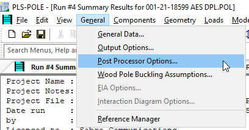
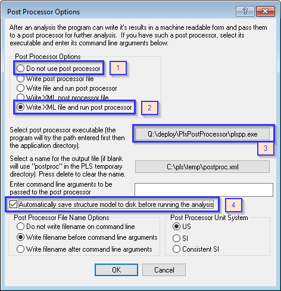
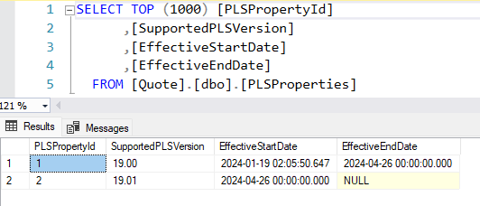

# PLS-POLE Post Processor By Mark Rogers

Power Line Systems has provided a way to execute a post processor at the
end of a structure analysis. The *Post* *Processor* *Options* definition
shown below is from the *PLS-POLE* *Manual* (v16.50) section 4.2.4.

> 4.2.4 Post Processor Options
>
> PLS-POLE users are provided with the ability to post-process the
> program results. Users who wish to do so can select the
> post-processing options shown in Fig. 4.2-5 with General/ Post
> **Processor** **Options.** (see figure below)
>
> The XML options are the best way to extract data from a **PLS-POLE**
> run and the only ones supported for new applications. The XML format
> has the benefit of being self-documenting and enjoys nearly universal
> support by other tools (such as MS Office, all development
> environments, etc.). To get started writing a post processor using the
> XML format all you need to do is select \"Write XML post processor
> file\". You can then review the resulting XML file using your
> preferred development tool. All output items have the same meaning as
> the corresponding data in the **Analysis** **Results** report.
>
> The post processor options should be of no concern to the great
> majority of users except for the following option which may be of
> interest:
>
> *Automatically* *save* *structure* *model* *to* *disk* *before*
> *running* *the* *analysis:* if checked the program will save the
> structure model whenever you execute the **Model/** **Run** command*

## The purpose of the Post Processor is twofold

> 1\. To generate DXF and PNG files showing the PLS structure. The PNG
> will be used for the SUEET GUI and the DXF file will be used to
> generate the PE Drawing.
>
> 2\. Create a zip file which will be imported into SUEET. The zip file
> will contain: a. DXF and PNG files.
>
> i\. Front view ii. Top view
>
> iii\. Isometric view b. Postproc.xml
>
> c\. WorkSpace directory -- contain all files which are required to run
> the PLS Pole model. d. WorkSpace.zip -- contain all files which are
> required to run the PLS Pole model.

The final zip file called *PlsUpload.zip* will contain all the files
described above. The *PlsUpload.zip* will be imported into SUEET. The
zip file is in \"C:\\pls\\temp\\stage\\PlsUpload.zip\".

The *Post* *Processor* *Options* are found
under General -\> Post Processor Options as shown in the snapshot.

**Note**, when you save the PLS-Pole model, the *Post* *Processor* *Options*
settings will be saved as well.

>
> 
>
> Fig 4.2-5

The *Post* *Processor* *Options* dialog shown above provides a way to
define a post processor which will run at the end of an analysis. The
snapshot shows the options in the blue rectangle which may be set.

> 1\. *Do* *not* *use* *post* *process*. Select this option if you do
> not want to run the post processor after every run. However, the
> [final run]{.underline} of the model **must** run the post processor
> to create the *PlsUpload.zip* file, which will be imported by SFC.
>
> 2\. *Write* *XML* *file* *and* *run* *post* *process* -- when you run
> the PLS model the PLS GUI will save the postproc.xml file and then run
> the post processor.
>
> 3\. *Select* *post* *processor* *executable*... \-- define the path to
> the PLS Post Processor. The PLS Post Processor executable is in
> \"Q:\\deploy\\PlsPostProcessor\\plspp.exe\" as shown in the snapshot
> above.
>
> 4\. *Automatically* *save* *structure* *model...* \-- The initial run
> MUST be saved before running the post processor. The .pol file
> contains paths to all file dependencies. Saving the file will ensure
> the dependency paths are correct.

Engineering will have two things to do to implement the PLS Post
Processor.
>
> 1\. The PLS template will have the *Post* *Processor* *Options* set as
> discusses above. At a minimum, the Pls Post Processor executable must
> be defined. The template will then have the post processor defined for
> all new projects using the template.
>
> 2\. For legacy PLS models, the engineer will need to manually define
> the *Post* *Processor* *Options*. The manual definition of the *Post*
> *Processor* *Options* will ensure the zip file is created. The zip
> file will be imported into SUEET and saved in the Quote database..

## Release Notes

> Release 1.14: will check the SFC Quote database to make sure the
> user is running the current version of PLS-Pole.  
> If the user is not using the correct version, the *PlsUpload.zip* file
> will **not** be created.

### SFC Quote database

> The SFC Quote database table *PLSProperty* contains the  field *SupportedPLSVersion*
> which will contain the current PLS-Pole version in the last record
>
> 
>

> Release 1.16: added following flag
>
> `~upgradeTest~`
>
> to aid the developer in checking the next version of PLS-Pole to ensure it 
> is compatible with SFC processes.
> The flag is provided as the first argument in *PlsPostProcess.exe*

## PLS-Pole Upgrade Procedure

This section  outlines the steps to follow when upgrading the PLS-Pole Version. It ensures a smooth transition while maintaining data integrity and system stability.

1. **Change Request Submission:**
    * Engineering initiates a Change Request to upgrade the PLS-Pole Version to the latest release on **all engineer’s PCs**.
    * The Change Request includes relevant details such as the target version and justification for the upgrade.

2. **Approval and Coordination:**
    * Wait for the Change Request to be **approved** by the relevant stakeholders and the review board.
    * Contact PC Support to establish an **Effective Start Date** for the new PLS-Pole version. This agreed-upon date allows PC Support sufficient time to install the upgraded PLS-Pole software on all engineer’s PCs.

3. **Software Development Verification:**
    * Software Development performs several tests to verify that the upgrade will not break SFC:
        * **XML File Compatibility:** Ensure that the XML file in the new version matches the structure of the previous XML version.
        * **PNG File Comparison:** Compare PNG files to confirm that structural images remain consistent across versions.
    * The PLS test models are located at `Q:\IT_dept\PLS_Validation`. Where
        * `PLS Test Models` folder contains an index of the PLS-Pole test models to verify the upgrade and the PLS-Pole models used to create the XML (postproc) and the [`PlsUpload.zip`](http://PlsUpload.zip) file containing the PNG images to verify. The [`PlsUpload.zip`](http://PlsUpload.zip) file is created using the production version of `PlsPostProcessor`.
        * A folder for each PLS-Pole version comparison will contain the four PLS-Pole model results.

4. **Database Update:**
    * Update the **SFC Quote Database** with the new supported PLS-Pole version and the effective start date.
    * Perform the update in the **Development**, **Test**, and **Production** databases.
    * Manually update two records in the `PLSProperties` table:
        * **Current Active Record:**
            * Set the `EffectiveEndDate` to match the `EffectiveStartDate` of the new record.
        * **Create a New Record:**
            * Set the `SupportedVersion` to the new PLS-Pole version.
            * Set the `EffectiveStartDate` to match the previously defined `EffectiveEndDate` in the current active record.

5. **Final Installation:**
    * After successful verification by Software Development, PC Support proceeds to install the **latest PLS-Pole version** on **all engineer’s PCs**.
    * Ensure that the installation is completed by the agreed-upon **Effective Start Date** discussed in step 2.

6. **PLS Post-Processor:**
    * Engineering utilizes the **PLS Post-Processor** to create the [`PlsUpload.zip`](http://PlsUpload.zip) file for uploading PLS-Pole models to SFC.
    * The PLS Post-Processor is located at the following paths:
        * **Production:** `Q:\deploy-prod\PlsPostProcessor`
        * **Test:** `Q:\deploy-test\PlsPostProcessor`
    * PLS Post-Processor will verify the engineer is running the currently supported PLS-Pole version. If the version is incorrect, the [`PlsUpload.zip`](http://PlsUpload.zip) file will not be created.

By following this procedure diligently, we ensure a seamless upgrade process and maintain the reliability of SFC and our PLS-Pole system.
